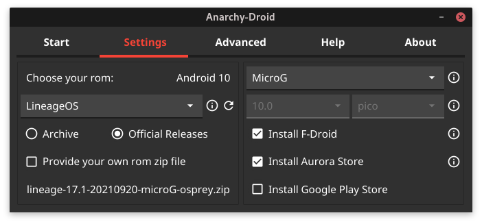
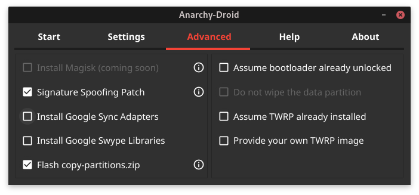
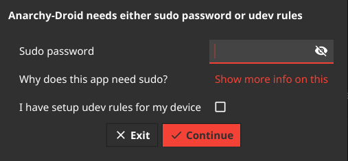

# Anarchy-Droid
One-Click Android rom installation assistant

Anarchy-Droid is an application designed to help you install custom roms on your Android device. It is supposed to make the process of finding, downloading and installing a rom (with addons like F-Droid and microG) as easy as possible. The primary audience is all the folks who do not really know anything about Android, TWRP or roms, but still would like to run a free, open-source and non-bloated Android on their devices. Using a free after-market rom like LineageOS should not be restricted to the few people with enough technical know-how to do the complex installation procedure all by themselves.

Anarchy-Droid is available for Windows, Mac and Linux. As of now, it should be working fine with Samsung, OnePlus, Motorola, NVidia and Sony devices and with all other devices that already have TWRP installed.

Anarchy-Droid is the successor of [Free-Droid](https://gitlab.com/free-droid/free-droid) which has been fully rewritten from scratch in go.

Table of Contents
=================

* [How it works](#how-it-works)
* [Usage](#usage)
   * [Start](#start)
   * [Settings](#settings)
   * [Expert settings](#expert-settings)
* [Help](#help)
* [Usage statistics](#usage-statistics)
* [I want to help](#i-want-to-help)
* [Uninstall](#uninstall)
* [Acknowledgements](#acknowledgements)

## How it works

Anarchy-Droid needs your device to be plugged in with USB and to have USB-Debugging enabled in the Android developer settings. Once Anarchy-Droid detects your device, it will start looking for available TWRP and roms. TWRP is a so-called recovery system that is used to install roms and therefore needs to be installed prior to the rom itself. Anarchy-Droid will only allow you to click the start button if everything needed actually is available for your device.  
When started, Anarchy-Droid will first download all the files it needs. They will preferably come from official sources and will be checked against md5 or sha256 checksums. Normally, this should boil down to TWRP, the rom itself and (if left to default settings) F-Droid, MicroG and the Aurora Store (the last three of which are installed using the [NanoDroid](https://gitlab.com/Nanolx/NanoDroid) packages). If your device does not seem to already run a custom rom, the second step will be booting TWRP. If needed, it will try to guide you through the process of unlocking your bootloader. After that, if we were able to boot the device into TWRP, Anarchy-Droid will check if the data partition is mountable, because it will need to be formatted for the new rom to run as expected. Finally, Anarchy-Droid will go through the installation of the rom with the additional extras like F-Droid and reboot your device to the new rom when finished.

## Usage

### Start

For the start button to become available, you will need to confirm that you have backups of what you need and to connect your device with USB/Android debugging enabled over a USB cable to your computer.
Connecting the device with USB should not be too hard, but if you need help enabling debugging in the developer settings, you can search youtube to see how it is done on your device. Normally, to enable the developer settings (hidden by default) on your device, you have to open the settings, then go to "about phone" and tap 7 times on "build number". After that, the developer settings become available in your settings and you can enable "android debugging".

IMPORTANT: If you have an option to enable "OEM unlock" in your developer settings, you *must* do so!

### Settings

On the settings panel of Anarchy-Droid, you can change some default settings to your liking. Most prominently, you may choose which rom to install - though there are a lot of devices for which only one rom is going to be available. Anarchy-Droid looks for official releases of LineageOS, LineageOS for MicroG, Resurrection Remix, Omnirom, CarbonROM, crDroid, /e/OS and AOSP-Extended. Additionally, it looks for roms available from the unofficial Anarchy-Droid archive holding roms mainly for devices with no official releases but with roms found to be working just fine on XDA.  
With the other settings you can choose whether to install the listed extras: MicroG, Google apps, F-Droid, the Aurora Store and the Google Play Store. For more information on these, visit the websites of the individual projects.

On this page of the application you can change some basic settings:

- Choose your rom: this is where you may select one of the available systems (rom) for installation. If available, LineageOS will be default, because it has the hardest requirements for a rom to be officially released for a specific device on their website. For the user this means that a stable quality rom can be expected. Still, other roms most likely are as good and stable as LineageOS, since they often are based on LineageOS. Notice that the Android version of the selected rom is displayed, so you can take that into consideration when deciding which rom to choose.

- Unofficial archive: The unofficial archive is a private rom archive of Anarchy-Droid. It is mainly meant to make roms available for devices with no rom available from official sources like the LineageOS website. If a rom is available from the unofficial archive, this field will be enabled. Keep in mind that downloads from the unofficial archive may be very slow, since noone is paying Anarchy-Droid for a server with a fast internet connection.

- Provide your own zip file: If you are sure about what you are doing, you may want to install a rom that you downloaded by yourself from somewhere like XDA as a zip file to your computer. In that case, tick this checkbox and select the zip file you wish to install.

- MicroG: MicroG replaces the Google Play Services and the Google Apps normally preinstalled on every Android device. It is needed for some non-free applications to work properly on a rom without the real Google Apps installed. It also allows your device to find its location by using wifi and cell towers in concordance with the open Mozilla database instead of the Google ones (needs to be configured in the MicroG settings after the installation is done).

- OpenGapps: Choose this to install the real Google Apps with the Play Services and the Play Store. You can choose from the different variants available.

- F-Droid: This is *the* app-store for free and open-source Android apps. It contains replacements for any non-free apps that you might use on a daily basis. It also offers apps that the Google Play Store will refuse to list and has purely free and open-source versions of apps that otherwise contain some non-free or closed-source components like Telegram and Organic Maps.

- Aurora Store: This is an app made to use the Google Play Store without having the original Play Store app installed. You can use it with your own Google account or without Google account. Note: If using it without Google account, you will not be able to install paid apps.

### Advanced settings

It is advised to only change these settings if you really know what they mean and what you are doing. Otherwise the result of the installation process might not be what you would expect.

You should only change these settings if you really know what you are doing!

<!-- - Install Magisk: Magisk is a very comfortable solution if you want to have full administration rights (root) on your Android. This is needed to apply changes to the system from within the system, but comes with the risk of breaking things if you do not really know what you are doing. If you do not know what root privileges are good for, do not to install Magisk. Caution: Installing magisk is getting more and more difficult. The installation method employed by Anarchy-Droid is now [discouraged](https://topjohnwu.github.io/Magisk/install.html#custom-recovery) and called a legacy installation method, because it can cause trouble and break the ability of the system to boot. -->

- Signature Spoofing Patch: Flash the signature spoofing patch provided by the NanoDroid project. It tries to enable signature spoofing on roms that have no native signature spoofing support. This is needed for all of MicroG's features to work correctly. Some roms alraedy have this patch included. In that case, this installation of the patch will be skipped.

- Install Google Sync Adapters: If you don't install the official Google Apps but still wish to sync your contacts and calendars with Google, then you can install these adapters.

- Install Google Swype Libraries: This is an extension to the Android keyboard allowing you to type whole words by swiping over the letters without lifting your finger. These libraries are closed source.

- Flash copy-partitions.zip: The official LineageOS [installation instructions](https://wiki.lineageos.org/devices/akari/install#pre-install-instructions) (for A/B devices) advise to flash this zip and to reboot to recovery prior to flashing the rom itself. It prevents issues with some devices.

- Assume bootloader already unlocked: (Irrelevant for Samsung devices) If no custom rom or running TWRP is detected, Anarchy-Droid will attempt to unlock your bootloader before starting the installation of TWRP. Note that you *need* an unlocked bootloader to install TWRP. Use this setting to skip the bootloader unlocking procedure if you know that your bootloader is unlocked.

- Do not wipe data partition: By default, Anarchy-Droid will always wipe the data partition and perform a so-called clean flash of the rom. Not wiping the data partition most certainly causes problems in the system after the installation. Use this to perform a "dirty flash" if you know what you are doing.

- Assume TWRP already installed: If you know that rebooting your device into recovery will bring up TWRP, you can tick this box. In that case, Anarchy-Droid will skip booting TWRP from the bootloader. Note: LineageOS always overwrites the installed recovery with its own recovery which is not compatible with Anarchy-Droid.

- Provide your own TWRP image: You can select a TWRP image file from your computer to be used instead of retrieving a TWRP image from the official TWRP releases or from the Anarchy-Droid unofficial archive.

## Help

### Device not detected

A few things first:
- Try another USB port on your computer
- Try another USB cable
- Try a USB hub
- Try to install official drivers (mainly for Windows users)
- Restart the computer

#### Windows
If Anarchy-Droid is unable to detect your device, you might need to install the official Windows drivers from the manufacturer of your device. Click [here](https://developer.android.com/studio/run/oem-usb#Drivers) to find where to download the driver for your device.

#### Linux

On Linux systems, normal users are not allowed to access the devices over USB in the way this application needs to. Therefore, you have to choose between two options: the first is to simply provide your sudo password, the second is to setup udev rules for android devices.
If you don't feel comfortable providing your sudo password to an unknown application, search the code of this repository for the keyword "sudo" and see for yourself that Anarchy-Droid is not going to misuse privileges.
If you wish to use udev rules, either configure the rules manually or, if your distribution has a packaged rule set, search for the keywords "android udev" in your distribution repositories and install the according package. In Archlinux, the package is called "android-udev".

## Usage statistics

By default, Anarchy-Droid collects some very useful information about how it is being used. These information are of course completely anonymous and consist of your device model and the success of the installation steps.
The collection of used devices and success rate is important, because it will reveal what devices Anarchy-Droid works well with, what devices it does not work with (yet) and how to make Anarchy-Droid more compatible with your devices.  

Click [here](https://stats.free-droid.com/index.php?module=Widgetize&action=iframe&secondaryDimension=eventAction&disableLink=0&widget=1&moduleToWidgetize=Events&actionToWidgetize=getCategory&idSite=3&period=range&date=2019-07-01,today&disableLink=1&widget=1) to view the collected data!

## I want to help

Awesome! Help is needed especially for increasing the number of compatible devices. When Anarchy-Droid detects a device, it will ask for its model name and then lookup a codename used to find the correct TWRP and roms. For this to work reliably, the [lookup file](lookups/codenames.yml) mapping model names like "Moto G 2015" to a codename like "osprey" will need to be updated.  
If your device is not (or wrongly) recognized by Anarchy-Droid, please get in touch to update the lookup file with your device model name. If the boot or installation of TWRP does not work, we might need to update another lookup file containing the [names of the partition](lookups/recovery_partition_names.yml) TWRP needs to get installed to. This is another aspect where help might be needed to make Anarchy-Droid compatible with your device. In the same way, we need to keep a third lookup file updated. [This one](lookups/recovery_key_combinations.yml) contains instructions on how to reboot a specific device to recovery with a combination of hardware keys to press, hold or switch. Finally, if there is just no rom available for your device, we probably can upload an unofficial release to the archive. In that case, please get in touch and tell what device needs an unofficial rom - and if you have a specific rom in mind, please leave a link to the XDA thread of the unofficial release to be uploaded to the archive.

## Uninstall

Anarchy-Droid does not need any installation or uninstallation. If you wish to get rid of it, just remove the application and the Anarchy-Droid folder it created.

## Acknowledgements

Anarchy-Droid would not be possible without the work of the following projects:

[LineageOS](https://lineageos.org),
[ResurrectionRemix](https://www.resurrectionremix.com),
[Omnirom](https://www.omnirom.org),
[CarbonROM](https://carbonrom.org),
[AOSP-Extended](https://aospextended.com),
[cdDroid](https://crdroid.net/),
[/e/OS](https://e.foundation/e-os/),
[TWRP](https://twrp.me),
[MicroG](https://microg.org),
[F-Droid](https://f-droid.org),
[Aurora](https://gitlab.com/AuroraOSS/AuroraStore),
[Magisk](https://forum.xda-developers.com/apps/magisk/official-magisk-v7-universal-systemless-t3473445),
[NanoDroid](https://gitlab.com/Nanolx/NanoDroid),
[XDA](https://www.xda-developers.com/).